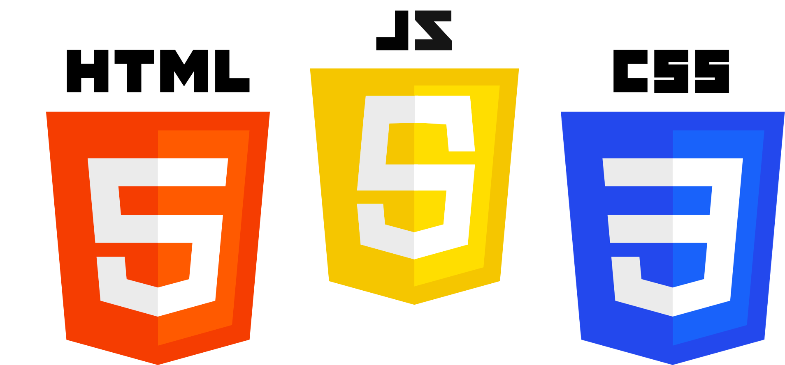

<a name="readme-top"></a>

<br />
<div align="center">
  
  <h3 align="center">Static Site Sample Project</h3>
  <p align="center">
    Sample project to test deployments with
  </p>
</div>

<!-- TABLE OF CONTENTS -->
<details>
  <summary>📋 Table of Contents</summary>
  <ol>
    <li>
      <a href="#about-the-project">About The Project</a>
      <ul>
        <li><a href="#built-with">Built With</a></li>
      </ul>
    </li>
    <li>
      <a href="#getting-started">Getting Started</a>
      <ul>
        <li><a href="#installation">Installation</a></li>
      </ul>
    </li>
    <li><a href="#license">License</a></li>
    <li><a href="#contact">Contact</a></li>

  </ol>
</details>

<!-- ABOUT THE PROJECT -->

## 📖 About The Project

This Sample Project can be used to **practice deployments with** for all Microverse students.

<p align="right">(<a href="#readme-top">back to top</a>)</p>

### Built With

The project specifications are the following:

|            | Version |
| ---------- | ------- |
| HTML       | 5       |
| CSS        | 3       |
| JavaScript | ES6+    |

<p align="right">(<a href="#readme-top">back to top</a>)</p>

<!-- GETTING STARTED -->

## 💻 Getting Started

To get a local copy up and running follow these simple steps.

### Installation

Following the steps to setup your project:

1. Clone the repo

   ```sh
   git clone https://github.com/noergitkat/static-sample.project.git
   ```

2. Navigate to the project

   ```sh
   cd static-sample-project
   ```

3. Double click on `index.html` to open it in the browser

<p align="right">(<a href="#readme-top">back to top</a>)</p>

<!-- License -->

## 🪪 License

Distributed under the MIT License. See `LICENSE.txt` for more information.

<p align="right">(<a href="#readme-top">back to top</a>)</p>

<!-- CONTACT -->

## 📞 Contact

Noer Paanakker - Technical Curriculum Designer - <a href="mailto:noer.paanakker@microverse.org">noer.paanakker@microverse.org</a>

<p align="right">(<a href="#readme-top">back to top</a>)</p>

---

_If you spot any bugs or issues, you can [open an issue with your proposed change](https://github.com/microverseinc/curriculum-transversal-skills/blob/main/git-github/articles/open_issue.md)._
